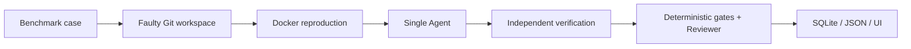

# IssueFlow

[中文说明](README.zh-CN.md) · [Phase-one evaluation](docs/phase-1-evaluation.md) · [Three-minute demo](docs/demo-script.md)

IssueFlow is a reproducible software-engineering Agent MVP. Phase one turns a vague idea, "let an Agent fix a bug," into a bounded experiment: a real LLM agent receives a pinned benchmark issue, works inside a controlled Git workspace, runs only registered checks in Docker, and leaves behind an auditable trace.

The current release focuses on one architecture, one benchmark family, and one clear question:

> Can a single Agent repair small Python bugs while every important step is reproducible, budgeted, sandboxed, and reviewable?

## Phase-one snapshot

| Area | Status |
| --- | --- |
| Benchmark catalog | 5 pinned `karpathy/micrograd` cases with provenance, reproduction, verification, and reference patches |
| Repair architecture | Single DeepSeek-powered Agent with allowlisted tools: search, read, patch, and registered test execution |
| Runtime safety | Network-disabled Docker sandbox, bounded CPU/memory/time/processes, and fixed tool budgets |
| Success judgment | Independent verification plus deterministic gates before any advisory model review |
| Evidence trail | SQLite persistence, redacted JSON export, Streamlit UI, diff, metrics, timeline, and reviewer result |
| Validation | `make verify-phase-1` covers lint, tests, sandbox image, benchmark replay, and trace checks |

## Why it matters

Many Agent demos are hard to evaluate because the environment, budget, test commands, and stopping rules are vague. IssueFlow makes those parts explicit. The point of phase one is not to claim a production repair service; it is to build a small but honest evaluation loop that can be extended into multi-agent comparisons later.

What phase one proves:

- A benchmark case can fully describe the repository revision, injected or historical bug, reproduction command, verification command, and reference patch.
- A live Agent run can be constrained by tool count, patch count, wall-clock time, tokens, and cost.
- Functional success can be decided by independent checks and a non-empty diff, without trusting the model's own explanation.
- Every meaningful step can be stored, redacted, exported, and inspected after the run.

## What you will learn

One repair run follows the same observable path every time:



- **Benchmark** defines the repository, exact revision, issue, reproduction, verification, provenance, and reference patch.
- **Workspace preparation** creates a separate Git clone and establishes the faulty code as its clean baseline.
- **Docker sandbox** runs only registered checks with no network and fixed resource limits.
- **Single Agent** may only search, read a file, apply a patch, and run a registered test.
- **RunService** connects reproduction, Agent execution, independent verification, diff collection, review, and persistence.
- **Reviewer** applies deterministic functional gates first; model review is advisory and cannot override failed tests.
- **TraceStore and UI** preserve and display the ordered, redacted evidence.

## Repository map

| Path | Purpose |
| --- | --- |
| [`benchmarks/micrograd.yaml`](benchmarks/micrograd.yaml) | Phase-one benchmark catalog and provenance |
| [`src/issueflow`](src/issueflow) | Agent loop, sandbox tools, run orchestration, review, tracing, and UI support |
| [`docker`](docker) | Reproducible verification environment |
| [`tests`](tests) | Unit, integration, Docker, benchmark, and trace checks |
| [`artifacts/phase-1`](artifacts/phase-1) | Credential-safe evidence from a live Agent run |
| [`docs/phase-1-evaluation.md`](docs/phase-1-evaluation.md) | Evaluation notes and phase-one evidence summary |
| [`docs/demo-script.md`](docs/demo-script.md) | Three-minute presentation script |

## Prerequisites

- An Apple Silicon Mac (M1 or later) with macOS
- Docker Desktop running with at least 4 GB available memory
- Git
- Python 3.11 or newer; Python 3.12 is recommended
- A valid DeepSeek API key for live Agent runs

## Quick start

Run these commands from the repository root:

```bash
python3 -m venv .venv
source .venv/bin/activate
python -m pip install -e '.[dev]'
```

Set the key in the **same terminal** that will start IssueFlow:

```bash
export DEEPSEEK_API_KEY='your-key-here'
```

Do not put the key in source files, screenshots, JSON exports, or commits. You can confirm that the variable exists without printing its value:

```bash
test -n "$DEEPSEEK_API_KEY" && echo "API key is set"
```

Build and verify the fixed environment, then start the workbench:

```bash
make docker-build
make verify-benchmarks
make demo
```

Open [http://localhost:8501](http://localhost:8501), select `constructed-01`, and choose **开始真实修复**. The page refreshes while the run is active and then shows its result, diff, test evidence, Reviewer conclusion, metrics, timeline, and JSON download.

Runtime data is stored under `.issueflow/` by default. Set `ISSUEFLOW_DATA_DIR` to use a different directory. Optional model settings are `ISSUEFLOW_MODEL` and `ISSUEFLOW_BASE_URL`.

## Verification commands

```bash
make lint                 # static checks and formatting
make docker-build         # build the fixed sandbox image
make test                 # full suite, including the Docker end-to-end test
make test-e2e             # Docker/Git/Agent/SQLite/JSON pipeline only
make verify-benchmarks    # all five cases fail before and pass after reference fixes
make verify-phase-1       # complete release check in the required order
```

Docker must be running for `make test`, `make test-e2e`, and `make verify-phase-1`. Benchmark verification also needs internet access to clone the pinned public repository.

## Benchmark provenance

All five cases use [karpathy/micrograd](https://github.com/karpathy/micrograd), licensed under MIT, at exact 40-character Git revisions.

| Case | Type | Meaning |
| --- | --- | --- |
| `historical-01` | Historical | A public upstream shared-graph gradient repair, linked to its original commit. |
| `constructed-01` | Constructed | Controlled unary-negation regression. |
| `constructed-02` | Constructed | Controlled power-gradient regression. |
| `constructed-03` | Constructed | Controlled ReLU zero-boundary regression. |
| `constructed-04` | Constructed | Controlled division regression. |

“Historical” means the defect and repair come from public upstream history. “Constructed” means IssueFlow injects a documented, minimal fault into a pinned upstream revision; it must not be presented as a historical micrograd bug. The complete source links, construction notes, and patches are in [`benchmarks/micrograd.yaml`](benchmarks/micrograd.yaml).

## Safety boundary

### Budget profiles

Every catalog case declares a profile: `historical-01` is `medium`, and the current constructed cases are `small`.

| Profile | Tools | Patches | Seconds | Input tokens | Output tokens | Cost cap |
| --- | ---: | ---: | ---: | ---: | ---: | ---: |
| `small` | 12 | 2 | 300 | 30,000 | 6,000 | $0.05 |
| `medium` | 18 | 4 | 450 | 50,000 | 8,000 | $0.10 |
| `large` | 24 | 6 | 600 | 80,000 | 12,000 | $0.20 |

Higher budgets increase available work but never guarantee a successful repair.

- The phase-one UI accepts only the five catalog cases; it does not accept arbitrary repositories or shell commands.
- Docker runs with networking disabled, a read-only container filesystem, bounded CPU, memory, processes, and time, with only the isolated workspace writable.
- Model tools and test commands are allowlisted; paths are checked against workspace escape.
- Tool-call, patch, time, token, and cost budgets stop unbounded runs.
- Credentials come from the process environment and are redacted before persistence. They are never mounted into the repair container.
- Passing reproduction/verification and a non-empty diff determine functional success. Reviewer output is additional evidence, not the authority.
- IssueFlow does not push code, open pull requests, run hidden tests, or repair arbitrary projects in phase one.

## Evidence and limitations

The checked-in [live Agent trace](artifacts/phase-1/constructed-01-live-run.json) is a credential-safe JSON export from a real DeepSeek run first stored in SQLite. The [evaluation report](docs/phase-1-evaluation.md) separates reference-patch replay from live-Agent results and explains the metrics.

This is an educational MVP, not a production repair service. It covers one small Python repository, public checks, one Agent, one host, and a local SQLite database. Model output can vary, API availability affects live runs, and the displayed duration is the sum of persisted execution-step durations rather than full wall-clock latency.
