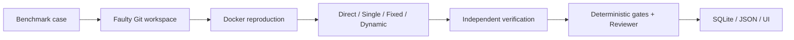

# IssueFlow

[中文说明](README.zh-CN.md) · [Phase 2 progress](docs/phase-2-progress.md) · [Architecture notes](docs/phase-2a-architecture-notes.md) · [Phase-one evaluation](docs/phase-1-evaluation.md)

IssueFlow is a reproducible software-repair architecture workbench for Apple Silicon Macs. Phase 2A runs Direct, phase-one Single, Fixed multi-agent, and Dynamic Supervisor implementations through the same five pinned `karpathy/micrograd` compatibility cases, network-disabled Docker checks, deterministic success gates, SQLite store, and downloadable JSON.

## What you will learn

One repair run follows the same observable path every time:



- **Benchmark** defines the repository, exact revision, issue, reproduction, verification, provenance, and reference patch.
- **Workspace preparation** creates a separate Git clone and establishes the faulty code as its clean baseline.
- **Docker sandbox** runs only registered checks with no network and fixed resource limits.
- **Architecture contract** gives all four arms the same case, workspace, budget, result, trace, and usage boundary.
- **Agents and roles** have fixed tool permissions: Planner and Reviewer have none, Retriever can search/read, and Single/Coder can apply patches and run registered tests.
- **RunService** connects reproduction, selected architecture execution, independent verification, diff collection, review, and persistence without architecture-specific success rules.
- **Reviewer** applies deterministic functional gates first; model review is advisory and cannot override failed tests.
- **TraceStore and UI** preserve and display the ordered, redacted evidence.

## Prerequisites

- An Apple Silicon Mac (M1 or later) with macOS
- Docker Desktop running with at least 4 GB available memory
- Git
- Python 3.11 or newer; Python 3.12 is recommended
- A valid DeepSeek API key for live Agent runs

## Quick start

Run these commands from the repository root:

```bash
python3 -m venv .venv
source .venv/bin/activate
python -m pip install -e '.[dev]'
```

Set the key in the **same terminal** that will start IssueFlow:

```bash
export DEEPSEEK_API_KEY='your-key-here'
```

Do not put the key in source files, screenshots, JSON exports, or commits. You can confirm that the variable exists without printing its value:

```bash
test -n "$DEEPSEEK_API_KEY" && echo "API key is set"
```

Build and verify the fixed environment, then start the workbench:

```bash
make docker-build
make verify-benchmarks
make demo
```

Open [http://localhost:8501](http://localhost:8501), select `constructed-01`, choose an architecture, and choose **开始真实修复**. Single remains the default. The page refreshes while the run is active and then shows its architecture, role/route trace, result, diff, test evidence, Reviewer conclusion, metrics, and JSON download.

Runtime data is stored under `.issueflow/` by default. Set `ISSUEFLOW_DATA_DIR` to use a different directory. Optional model settings are `ISSUEFLOW_MODEL` and `ISSUEFLOW_BASE_URL`.

## Verification commands

```bash
make lint                 # static checks and formatting
make docker-build         # build the fixed sandbox image
make test                 # full suite, including the Docker end-to-end test
make test-e2e             # Docker/Git/Agent/SQLite/JSON pipeline only
make verify-benchmarks    # all five cases fail before and pass after reference fixes
make verify-phase-1       # complete release check in the required order
make test-phase-2         # Phase 2A checks, one-fixture E2E, and 4×5 compatibility matrix
```

Docker must be running for `make test`, `make test-e2e`, `make verify-phase-1`, and `make test-phase-2`. Benchmark verification and the Phase 2A compatibility matrix also need internet access to clone the pinned public repository.

## Benchmark provenance

All five cases use [karpathy/micrograd](https://github.com/karpathy/micrograd), licensed under MIT, at exact 40-character Git revisions.

| Case | Type | Meaning |
| --- | --- | --- |
| `historical-01` | Historical | A public upstream shared-graph gradient repair, linked to its original commit. |
| `constructed-01` | Constructed | Controlled unary-negation regression. |
| `constructed-02` | Constructed | Controlled power-gradient regression. |
| `constructed-03` | Constructed | Controlled ReLU zero-boundary regression. |
| `constructed-04` | Constructed | Controlled division regression. |

“Historical” means the defect and repair come from public upstream history. “Constructed” means IssueFlow injects a documented, minimal fault into a pinned upstream revision; it must not be presented as a historical micrograd bug. The complete source links, construction notes, and patches are in [`benchmarks/micrograd.yaml`](benchmarks/micrograd.yaml).

## Safety boundary

### Budget profiles

Every catalog case declares a profile: `historical-01` is `medium`, and the current constructed cases are `small`.

| Profile | Tools | Patches | Seconds | Input tokens | Output tokens | Cost cap |
| --- | ---: | ---: | ---: | ---: | ---: | ---: |
| `small` | 12 | 2 | 300 | 30,000 | 6,000 | $0.05 |
| `medium` | 18 | 4 | 450 | 50,000 | 8,000 | $0.10 |
| `large` | 24 | 6 | 600 | 80,000 | 12,000 | $0.20 |

Higher budgets increase available work but never guarantee a successful repair.

- The phase-one UI accepts only the five catalog cases; it does not accept arbitrary repositories or shell commands.
- Docker runs with networking disabled, a read-only container filesystem, bounded CPU, memory, processes, and time, with only the isolated workspace writable.
- Model tools and test commands are allowlisted; paths are checked against workspace escape.
- Tool-call, patch, time, token, and cost budgets stop unbounded runs.
- Credentials come from the process environment and are redacted before persistence. They are never mounted into the repair container.
- Passing reproduction/verification and a non-empty diff determine functional success. Reviewer output is additional evidence, not the authority.
- IssueFlow does not push code, open pull requests, run hidden tests, or repair arbitrary projects in phase one.

## Evidence and limitations

The checked-in [live Agent trace](artifacts/phase-1/constructed-01-live-run.json) is a credential-safe JSON export from a real DeepSeek run first stored in SQLite. The [evaluation report](docs/phase-1-evaluation.md) separates reference-patch replay from live-Agent results and explains the metrics. Phase 2A likewise separates three kinds of evidence: `5/5` external reference-patch replays validate the catalog, `4/4` architecture runs on one local fixture validate the infrastructure, and a `20/20` four-architecture-by-five-case matrix uses literal scripted decisions—never reference-patch application—to validate the full Git/Docker/RunService/SQLite/JSON wiring.

This is an educational MVP, not a production repair service. Phase 2A proves four-architecture integration on one small Python repository and public checks; it does not yet contain the new strict benchmark or comparative experiment results. LangGraph checkpoints are in memory, runs use one host and local SQLite, model output can vary, and API availability affects live runs. See the [Phase 2A architecture notes](docs/phase-2a-architecture-notes.md) for design details and limitations.
